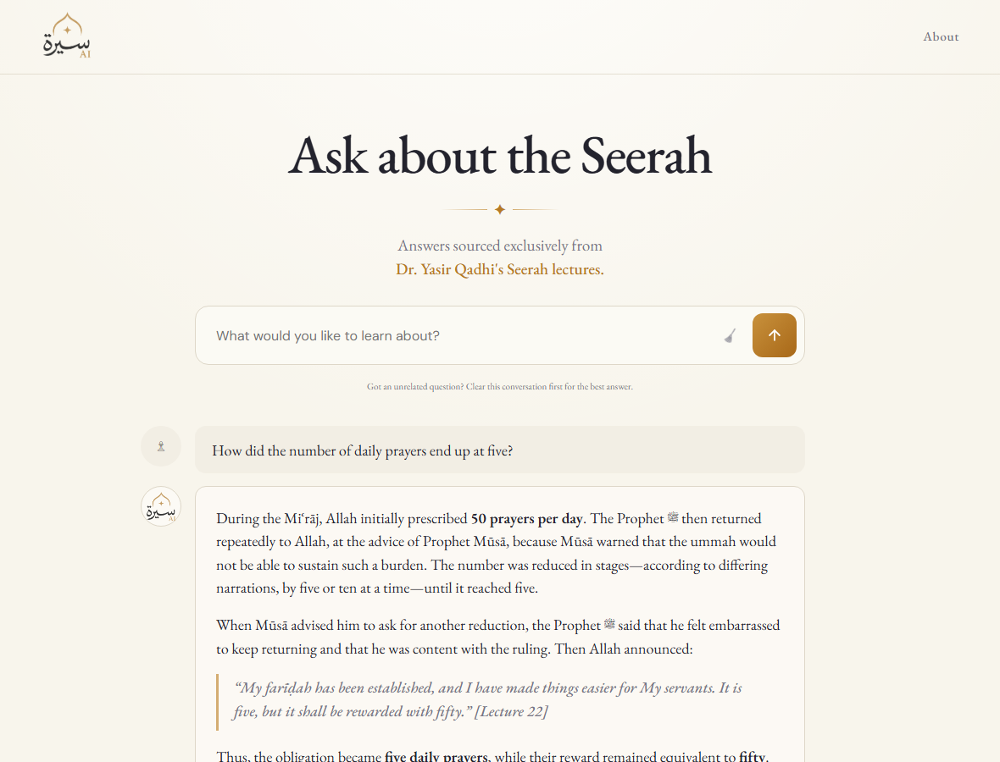
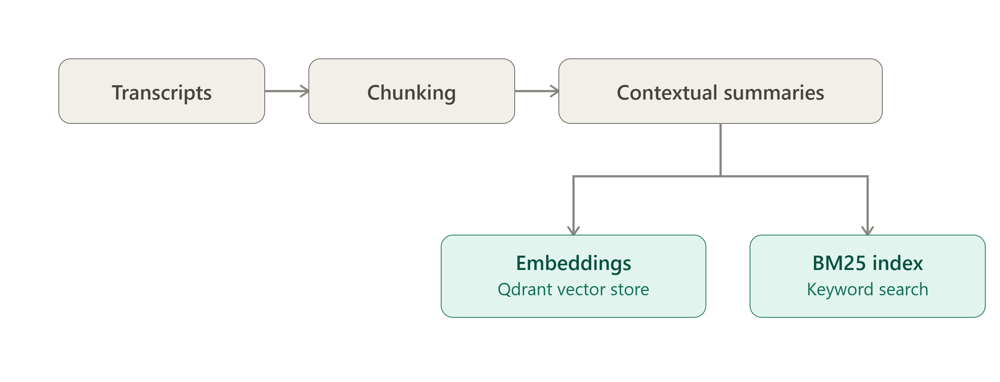
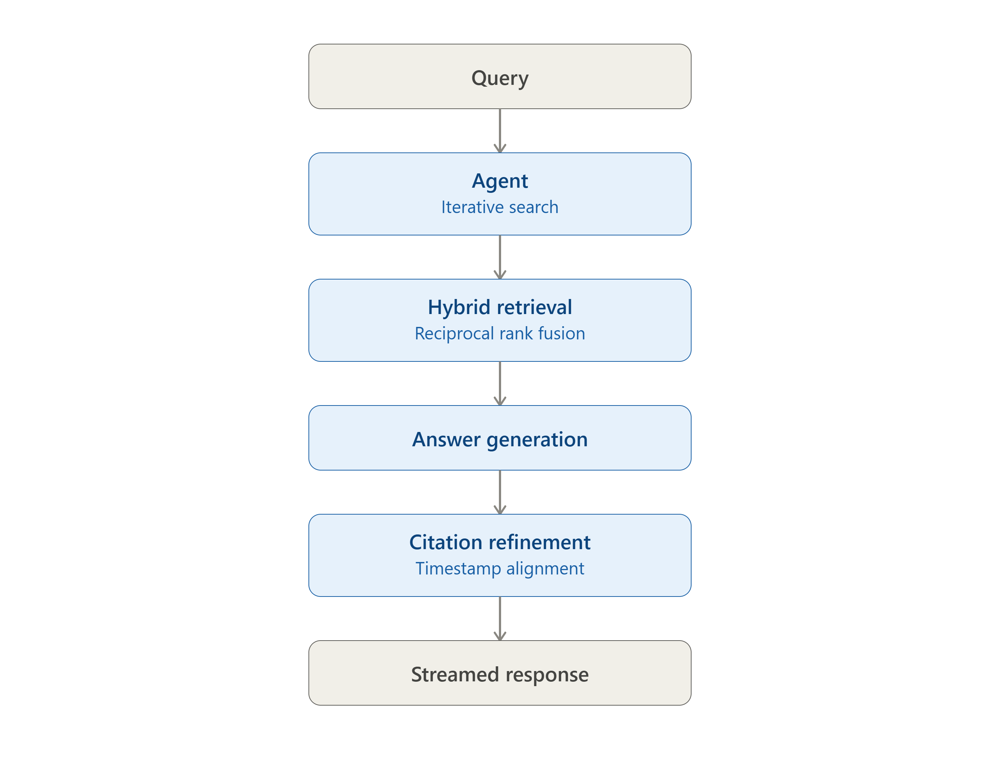

<h1 align="center">Seerah AI</h1>

A retrieval-augmented Q&A system over Shaykh Dr. Yasir Qadhi's 104-part Seerah lecture series (the life of the Prophet Muhammad ﷺ). Ask a question in natural language and get an answer grounded in the actual lecture transcripts, with a citation back to the exact lecture and timestamp it came from.

**Live demo**: [seerah-ai.ibrahimumair900.workers.dev](https://seerah-ai.ibrahimumair900.workers.dev)



## Overview

The source material is 104 long-form video lectures (~1.3M words total) with no searchable index — finding where a specific event is discussed means scrubbing through hours of video. This project turns that corpus into something queryable: natural-language questions are answered from the transcripts themselves, not from an LLM's general knowledge, with every claim traceable to a specific lecture and moment in the video.

## Features

- **Natural-language Q&A** grounded exclusively in the lecture transcripts
- **Hybrid retrieval** — BM25 keyword search + vector search, fused with Reciprocal Rank Fusion
- **Agentic search loop** — the model can search multiple times, rewording its query if initial results are weak
- **Timestamp-precise citations** — a dedicated pass matches each answer back to the exact `[HH:MM:SS]` moment in the source video, not just the retrieved chunk's start
- **Streaming responses** with multi-turn conversation support
- **User feedback + monitoring** — thumbs up/down on both answer quality and citation accuracy, visualized on a live dashboard

## Architecture

**Ingestion**: transcripts are split with sentence-aware chunking, enriched with an LLM-generated contextual summary per chunk (improves retrieval by giving each chunk surrounding context it would otherwise lack), then embedded (OpenAI `text-embedding-3-large`) and indexed for both vector and keyword search.



**Query time**: an agent (`seerah/agent.py`) issues one or more searches against the hybrid index, synthesizes an answer strictly from what it retrieves, and cites the supporting lecture(s). A second pass then pins each citation to the exact timestamp in the source video that supports the specific claim being made, validated against real transcript timestamps so nothing is invented.



## Evaluation

Retrieval and generation are evaluated separately, against a 304-question benchmark set spanning single-chunk, multi-chunk, and cross-lecture questions.

**Retrieval** (recall@10):

| Method | Recall |
|---|---:|
| BM25 only | 0.520 |
| Vector only | 0.687 |
| **Hybrid (RRF)** | **0.699** |

Hybrid retrieval outperforms either method alone, particularly for questions whose answer requires multiple chunks.

**Generation**, judged by an LLM on two independent axes — relevance to a curated reference answer, and faithfulness to the retrieved context:

| Metric | Result |
|---|---|
| Relevant | 99.0% |
| Grounded (no hallucination) | 97.0% |

The agentic pipeline (iterative search, self-correction) is used in production over a single-shot alternative also implemented in this repo, based on this evaluation.

## Tech Stack

- **Qdrant** — vector store for semantic search over lecture chunks
- **BM25** — keyword search, fused with vector results via Reciprocal Rank Fusion
- **OpenAI API** — embeddings, answer generation, and the agentic search loop (Responses API)
- **FastAPI** — backend API, streaming responses over Server-Sent Events
- **PostgreSQL** — conversation logs and user feedback
- **React + Vite** — chat interface
- **Grafana** — usage, cost, and feedback dashboard
- **Docker Compose** — local development and service orchestration

## Getting Started

Requires Python 3.13, Docker, and an OpenAI API key. The expensive pipeline artifacts (chunks, embeddings) are pre-committed, so a fresh setup doesn't require re-running ingestion.

```bash
pip install -r requirements.txt
cp .env.example .env                   # add your OPENAI_API_KEY

docker compose up -d qdrant postgres
python -m seerah.ingest.embed           # populates Qdrant (~3 min)
python -m seerah.ingest.bm25            # builds the keyword index
python -m seerah.db                     # creates the Postgres schema

docker compose up -d                    # app, qdrant, postgres, grafana
curl http://localhost:8000/health
```

Frontend:

```bash
cd frontend
npm install
npm run dev
```

With `make` installed: `make install && make setup && make query` runs the same sequence. `make help` lists every target. A `.devcontainer` config is included for GitHub Codespaces.

## API

| Route | Description |
|---|---|
| `GET /health` | Liveness check |
| `POST /ask` | `{question, previous_response_id?}` — streamed as Server-Sent Events |
| `POST /feedback/{id}` | `{score: 1 \| -1}` — rate the answer |
| `POST /feedback/{id}/timestamp` | `{score: 1 \| -1}` — rate the citation's timestamp accuracy |

## Monitoring

Every request is logged to Postgres (tokens, cost, latency, citation-timing) alongside user feedback, visualized on a Grafana dashboard provisioned automatically from `grafana/provisioning/`.


## Project Structure

```
📁seerah/
  🐍config.py              paths, models, and constants
  🐍retrieve.py            vector + BM25 retrieval
  🐍answer.py              single-shot RAG pipeline
  🐍agent.py               agentic RAG pipeline
  🐍db.py                  Postgres schema + logging
  🐍api.py                 FastAPI app
  📁ingest/                chunking, contextualization, embedding, indexing
  📁eval/                  retrieval + LLM-as-judge evaluation
📁frontend/                React + Vite chat UI
📁grafana/provisioning/    dashboard + data source config
📁data/                    dataset and pipeline artifacts
🐳Dockerfile
🐳docker-compose.yml
```
