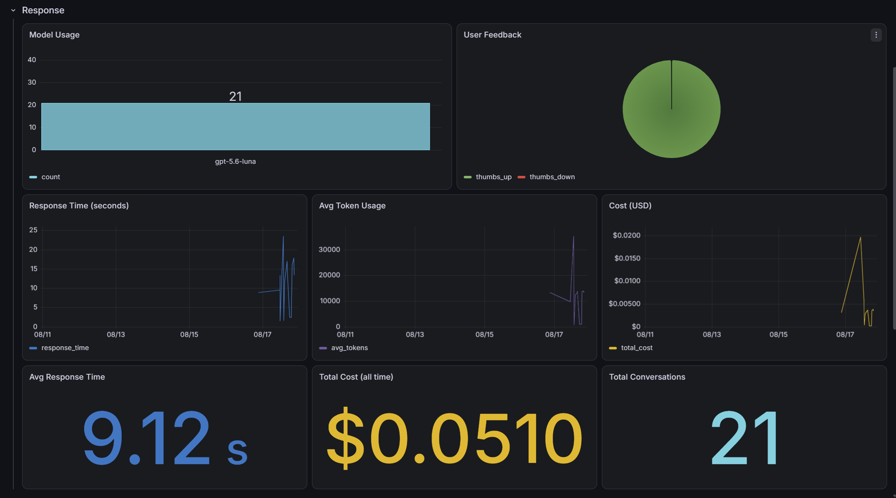

# Seerah Lookup & Summarizer

A RAG (Retrieval-Augmented Generation) application built over Shaykh Dr. Yasir Qadhi's Seerah lecture series — a 104-part lecture course on the life of the Prophet Muhammad ﷺ. This project was built as a capstone for the DataTalks.Club LLM Zoomcamp.

**Live app**: [seerah-ai.ibrahimumair900.workers.dev](https://seerah-ai.ibrahimumair900.workers.dev) — frontend on Cloudflare Workers, backend API at `api.seerahaiapp.tech` on an AWS Lightsail VM. See "Application interface" below for the full deployed architecture.

## Problem Statement

Yasir Qadhi's Seerah series is one of the most detailed English-language accounts of the Prophet's life available, but it exists as 104 long-form video lectures (averaging ~13,000 words / ~45-75 minutes each) with no searchable index. If someone wants to know "why did the Quraysh decide to fight at Uhud?" or "what happened during the Prophet's final illness?", their only option today is to scrub through hours of video hoping to land on the right lecture.

This project turns that lecture series into something you can actually query: ask a question in natural language, and get an answer grounded in what Yasir Qadhi actually said, with a citation back to the specific lecture (and its YouTube link) it came from — rather than a generic answer from an LLM's general knowledge, which risks getting specific historical/religious details wrong or ungrounded.

## Dataset

- **Source**: 104 lecture transcripts from the Yasir Qadhi Seerah series, stored as `data/seerah_transcripts.jsonl` (one JSON object per line).
- **Fields per lecture**: `lecture_number`, `canonical_title`, `youtube_url`, `text` (the full transcript).
- **Scale**: ~1.32 million words / ~1.78 million tokens total across the corpus. Average lecture is ~12,720 words (~17,100 tokens); the longest lecture ("The Death of Prophet Muhammad") is ~18,700 words (~25,300 tokens).
- **Character of the text**: raw spoken-lecture transcript — no paragraph breaks, no timestamps, no headings, and no newline characters anywhere. It's conversational English heavily mixed with transliterated Arabic/Islamic terminology and occasional Quranic Arabic script. This matters a lot for chunking: there is no structural markup to lean on, only the flow of speech itself.

## Data Preparation: Chunking Strategy

Chunks are built with sentence-aware splitting (LlamaIndex `SentenceSplitter`, 800 tokens / 80 token overlap) rather than a fixed-size token window — the splitter packs whole sentences up to the token budget, so a chunk never begins or ends mid-sentence. This matters because the transcripts are raw spoken narrative with no paragraph breaks or headings to lean on otherwise.

---

### Chunking reproducibility, and a data defect this uncovered

Because `SentenceSplitter` shifts chunk boundaries depending on whether metadata is passed in, an early inconsistency between runs (some with metadata, some without) caused 3 lectures to be cut two different ways between an interrupted run and its resume — silently dropping **2,201 characters** that ended up in no chunk at all and couldn't be retrieved. Nothing errored; the run looked healthy. Fixed for good with two changes: `chunk.py` now asserts full transcript coverage on every run (every character of all 104 transcripts must land in some chunk), and stage 2's cache is keyed on a SHA-256 fingerprint of the exact chunk texts, so any boundary change forces a clean re-summarization instead of silently splicing two incompatible cuts together. `data/chunking_manifest.json` records which mode produced each lecture, so re-chunking reproduces the same boundaries rather than cutting a third way.

---

## Retrieval Evaluation: the 10-lecture pilot

Before scaling to the full corpus, retrieval was piloted on a 10-lecture sample (lectures 8, 10, 21, 34, 44, 53, 66, 76, 89, 100) against 25 labeled questions with verified ground-truth chunks — comparing plain chunks vs. chunks with an LLM-written contextual summary prepended (Anthropic's "Contextual Retrieval"), across BM25 and two embedding models, scored with Hit Rate@k and MRR. Everything lives in `pilot_evaluation/` and can be re-run (`make eval`) or inspected directly from the committed result files, no API key or Docker required.

| Retriever | Hit@1 | Hit@5 | Hit@10 | MRR |
|---|---:|---:|---:|---:|
| BM25 (plain) | 0.36 | 0.80 | 0.84 | 0.529 |
| BM25 (contextual) | 0.52 | 0.84 | 0.88 | 0.631 |
| Vector, BGE-M3 (plain) | 0.52 | 0.72 | 0.76 | 0.612 |
| Vector, BGE-M3 (contextual) | 0.40 | 0.84 | 0.96 | 0.618 |
| Vector, OpenAI large (plain) | 0.48 | 0.84 | 0.92 | 0.633 |
| Vector, OpenAI large (contextual) | **0.56** | **1.00** | **1.00** | **0.726** |

**Verdict**: contextual chunking helps consistently across every retriever tested. OpenAI's `text-embedding-3-large` + contextual chunks wins outright, with a perfect Hit@5/Hit@10 across all 25 questions. BGE-M3 was tried first since it runs locally with no external API dependency, but was dropped once `text-embedding-3-large` clearly beat it on every metric — its numbers stay in the table above as the record of that decision, but the code itself (`build_bge_index.py`, plus the `torch`/`sentence-transformers` dependency it needed) was removed rather than carried forward for a model that had already lost.

**Caveat**: 25 questions from a 10-lecture sample is a small enough sample that a few flipped outcomes would move these numbers noticeably. It's also likely BM25 does artificially well here since the questions were LLM-generated from the same transcripts, reusing their exact spelling of names ("Badr") in a way a real user typing "Badar" wouldn't — addressed in production by the agentic bot's own query rewriting (see "LLM output evaluation" below) and re-evaluated properly at full scale next.

---

## Scaling to the full corpus

With the retrieval approach settled — sentence-aware chunks, contextual summaries, `text-embedding-3-large` — the same pipeline was run over all 104 lectures, producing **2,763 contextual chunks**.

Doing this synchronously does not work: each contextual-summary request carries the full ~17k-token lecture as context, so the account's 200,000 TPM synchronous limit is hit constantly. The pipeline uses OpenAI's **Batch API** instead, which draws on a separate quota and is 50% cheaper. Batch has its own constraint though — a 2,000,000 enqueued-token cap, against a corpus that totals ~26M enqueued tokens. Submitting everything at once is rejected outright with `token_limit_exceeded`. So whole lectures are bin-packed by their real token count into sequential waves, each under budget, submitted one at a time and polled to completion before the next.

Total cost for the full corpus: **$1.47** for contextual summaries (batch pricing, ~80% prompt-cache hit rate) plus **$0.28** for embeddings.

---

## Retrieval evaluation on the full corpus, and hybrid search

The 10-lecture pilot's ground truth was single-chunk, so Hit Rate@k/MRR (as taught in the course) applied directly. That premise breaks on the full corpus: the lecturer is repetitive and serializes events across multi-part arcs (Badr spans 7 lectures, the Conquest of Makkah spans 6), so a realistic answer often needs 2-4 chunks, sometimes from lectures dozens apart.

To measure this honestly, an LLM wrote **304 tiered questions** against the real transcripts, each with a reference answer and verbatim supporting quotes — see `data/eval_questions_raw.json` and `seerah/eval/`. Tiers: **T1** (63, one chunk), **T2** (117, several chunks in one lecture), **T3** (124, several lectures — 40 of those tagged **cross-episode**, where the lectures are far apart rather than consecutive arc parts). Metrics are **recall@k** (the direct generalization of Hit Rate@k to multi-chunk ground truth — they're identical when a question needs exactly one chunk) and **full-coverage@k** (were *all* required chunks retrieved, not just some — the harsher, more decision-relevant bar for a question needing several pieces of evidence).

**Vector vs. BM25 vs. hybrid (Reciprocal Rank Fusion), top-10, all 304 questions:**

| Tier | n | Vector recall/full-cov | BM25 recall/full-cov | Hybrid k=60 (textbook default) | Hybrid k=8 | Hybrid k=10 (chosen) |
|---|---:|---|---|---|---|---|
| T1 | 63 | 0.847 / 0.809 | 0.704 / 0.651 | 0.881 / 0.841 | 0.929 / 0.889 | 0.929 / 0.889 |
| T2 | 117 | 0.703 / 0.419 | 0.510 / 0.248 | 0.662 / 0.427 | 0.699 / 0.453 | 0.699 / 0.462 |
| T3 | 124 | 0.591 / 0.266 | 0.436 / 0.177 | 0.562 / 0.282 | 0.578 / 0.298 | 0.582 / 0.298 |
| cross-episode | 40 | 0.508 / 0.200 | 0.354 / 0.125 | 0.481 / 0.225 | 0.479 / 0.225 | 0.479 / 0.225 |
| **ALL** | 304 | 0.687 / 0.438 | 0.520 / 0.303 | 0.667 / 0.454 | 0.697 / 0.480 | **0.699 / 0.484** |

**Why RRF, and why k=10:** vector and BM25 scores are on incomparable scales (cosine ~0.5-0.6 vs. BM25 ~5-9), so RRF fuses on rank position instead (`score = Σ 1/(k + rank)`), sidestepping the scale mismatch entirely. `k=60` is the standard constant from the original RRF paper, but sweeping `k` against this same 304-question set (`python -m seerah.eval.sweep_rrf_k`) found `k=10` wins outright: at `k=60`, hybrid only traded lower recall for better full-coverage against vector alone (0.667/0.454 vs. 0.687/0.438); at `k=10`, a smaller k rewards a single retriever's strong ranking more decisively, and hybrid beats vector alone on **both** metrics at once (0.699/0.484).

**Reproducing this**: `python -m seerah.eval.run_retrieval --batch` scores vector/BM25/hybrid against all 304 questions; `python -m seerah.eval.sweep_rrf_k` re-runs the k sweep; `python -m seerah.eval.validate_questions` checks the question set's own integrity (verbatim quotes, no duplicates, tier consistency) before trusting its numbers.

---

## LLM output evaluation: simple pipeline vs. agentic RAG

Good retrieval doesn't guarantee a good final answer — the generator can still miss part of a multi-part question or state something the retrieved context doesn't support. This project ships two generation backends, kept deliberately separate:

- **`seerah.answer.SeerahRAG`** — one retrieval call, one generation call. The simple pipeline.
- **`seerah.agent.SeerahAgent`** (`seerah/agent.py`) — an agentic loop: a `search` tool the model calls itself, up to `AGENT_MAX_ITERATIONS` times, deciding when to search again and how to reword the query (e.g. Arabic transliteration ambiguity like `Badr`/`Badar`).

**Judge** (`seerah/eval/judge_answers.py`): an LLM judge scores every answer on two separate axes — **Relevance** (does it substantively match a curated reference answer) and **Faithfulness** (is it actually supported by the context it was given this run, independent of whether it's historically correct — the hallucination check).

**Baseline** (simple pipeline, all 304 questions): 248 RELEVANT, 53 PARTLY_RELEVANT, 3 NON_RELEVANT. The 56 non-RELEVANT questions were retested on the agentic bot across several rounds of instruction refinement (56 → 15 → 11 → 3 still not RELEVANT). The last 2 failures traced back to the lecturer's own transcript misstating a date or outcome rather than any model or retrieval bug, and were corrected as a 2-chunk surgical patch (transcript → chunk → summary → embedding → BM25) rather than a full re-chunk of the corpus.

**Final result** (`data/eval_final_results.json`, 303 of 304 — one question was a genuine 3-way judge split and excluded rather than forced into a category):

| Relevance | n | % |
|---|---:|---:|
| RELEVANT | 300 | 99.0% |
| PARTLY_RELEVANT | 3 | 1.0% |
| NON_RELEVANT | 0 | 0.0% |

Faithfulness across all 303: **294 GROUNDED, 9 PARTIALLY_GROUNDED, 0 UNGROUNDED** — no hallucination found anywhere in the set.

The 233 questions that already passed on the simple pipeline weren't individually re-run on the agentic bot (a strict superset of its capability, same retrieval and model plus the ability to search again); a stratified 5-question spot-check confirmed no regression. 3 questions remain PARTLY_RELEVANT — a known, documented limitation.

**Reproducing this**: `python -m seerah.eval.judge_answers --full` (baseline) or `--full --agentic`; `--retest-file <prior_output.json> --agentic` to re-judge only flagged questions; `--ids A,B,C --agentic --repeat 3` to check self-consistency.

---

## Citation precision: pinpointing the exact moment in the video

A retrieved chunk's *start* timestamp isn't the same as where its content actually begins — an ~800-token chunk can span several minutes, and the claim an answer makes is often well past that start. Linking every citation to "wherever the chunk starts" would frequently land a viewer near, but not at, the right moment.

`SeerahAgent._refine_citations()` (`seerah/agent.py`) fixes this without touching retrieval: after the answer is written, a separate OpenAI Structured Outputs call is given the question, the answer, and the top 3 retrieved passages (each sentence individually timestamped), and picks out the exact `[HH:MM:SS]` marker(s) that actually support what was said. A returned timestamp is only applied if it matches verbatim against the real sentence timestamps shown to the model — anything hallucinated or mismatched is dropped, falling back to the chunk's own start time. This same pass also picks which source is shown as *primary*, rather than whichever chunk simply scored highest in retrieval.

Users can flag when a timestamp lands on the wrong moment via the frontend's second 👍/👎 control (`/feedback/{id}/timestamp`), tracked separately from overall answer quality — see Monitoring below.

---

## Application interface

**Backend** (`seerah/api.py`, FastAPI): wraps `SeerahAgent` behind four routes.

| Route | Purpose |
|---|---|
| `GET /health` | liveness check |
| `POST /ask` | `{question, previous_response_id?}` → streamed as Server-Sent Events (see below); rate-limited to 10 requests/minute per client IP |
| `POST /feedback/{id}` | `{score: 1 \| -1}` — thumbs up/down on the answer overall |
| `POST /feedback/{id}/timestamp` | `{score: 1 \| -1}` — thumbs up/down on the primary citation's timestamp specifically (did the video land on the right moment), a separate signal from the answer-quality rating above |

`previous_response_id` (returned from the prior `/ask`) is handed to OpenAI's Responses API, which resumes that conversation's full state server-side, so no message history needs reconstructing client-side. Every call is logged to Postgres (see Monitoring below). `/ask` streams tokens as they're generated rather than waiting on the whole answer, and is rate-limited to 10 requests/minute per client IP since each call costs real OpenAI money.

**Frontend** (`frontend/`, React + Vite): a chat-style UI over that API — ask a question, get an answer with clickable sources linking to the exact lecture *and timestamp*, rate the answer and the citation's timestamp separately, keep asking follow-ups in the same thread or start fresh with "Clear chat."

**Running it locally**: first time on a fresh clone, follow "Quick start" below in order (Qdrant needs to be populated *before* the API container starts, or it crash-loops). After that's done once, day-to-day it's just:
```bash
docker compose up -d        # backend + Qdrant + Postgres + Grafana
cd frontend && npm install && npm run dev
```
`frontend/.env`'s `VITE_API_URL` must point at wherever the backend is actually reachable (`http://localhost:8000` by default).

**Deployment (live)**: the frontend is a static build deployed to **Cloudflare Workers** at [seerah-ai.ibrahimumair900.workers.dev](https://seerah-ai.ibrahimumair900.workers.dev), redeploying automatically on every push to `main`. The backend + Qdrant + Postgres + Grafana run via the same `docker-compose.yml` on an **AWS Lightsail** VM (2 vCPU/4GB), with `caddy` added for real TLS via Let's Encrypt — see "TLS / going public" under Containerization. Backend deploys are manual (`git pull && docker compose build app && docker compose up -d app` on the VM) rather than automated, since every `/ask` call costs real money and a silent bad deploy is worse than a step you have to remember.

## Monitoring & analytics

Every `/ask` call logs one row to Postgres (`conversations`: question, answer, sources, tokens, cost, response time, and `citation_time` — the citation-refinement pass timed separately from the main answer). `/feedback` and `/feedback/{id}/timestamp` each write to their own table, since answer quality and citation-timestamp precision are separate signals a user may rate independently. All three link by `conversation_id`; schema and helpers live in `seerah/db.py`.

**Grafana** (`grafana/provisioning/`) reads directly from that same Postgres, fully provisioned from checked-in YAML/JSON — no manual dashboard setup, reproduces from a bare `docker-compose up`. 11 panels across two sections, **Response** and **Timestamp**:



Access at `http://localhost:3000` (`admin`/`admin` locally; production sets a real password via `.env` and is reachable only through an SSH tunnel, never exposed publicly).

## Containerization

`docker-compose.yml` runs 4 core services — `app` (FastAPI backend, built from the root `Dockerfile`), `qdrant`, `postgres`, `grafana` — plus an optional 5th, `caddy` (see "TLS / going public" below). One command, `docker compose up -d`, brings up the backend stack.

The `Dockerfile` builds the BM25 index at image-build time from the committed chunk data, so the image is self-contained on a fresh clone. It does **not** run the embedding step (`seerah.ingest.embed`) — that's a one-time, ~$0.28 API-dependent step you run once against a running Qdrant, same as the Quick start below.

**Network exposure**: `app`, `postgres`, `qdrant`, and `grafana` all bind to `127.0.0.1` only — none are meant to be reachable from outside the host directly (Qdrant/Postgres have weak default auth; Grafana is an internal ops dashboard, see Monitoring above).

**TLS / going public**: `caddy` is the only service meant to be internet-facing, opt-in via `docker compose --profile proxy up -d` (or `make up-proxy`) rather than part of the default `up`. It reverse-proxies to `app` and auto-provisions a real Let's Encrypt certificate for `DOMAIN` (set in `.env`) on first start — required since a browser won't let a deployed HTTPS frontend call a plain `http://` backend at all ("mixed content").

The frontend is intentionally not part of this compose file — see "Application interface" above for why.

---

## Running the pipeline

### Quick start

The expensive artifacts are committed, so getting a working system does **not** mean re-running the whole pipeline. You need Python 3.13, Docker, and an OpenAI API key.

```bash
pip install -r requirements.txt
cp .env.example .env              # then put your OPENAI_API_KEY in it

docker compose up -d qdrant postgres   # infra first, not the app yet - see note below
python -m seerah.ingest.embed          # embeds the committed chunks into Qdrant (~$0.28, ~3 min)
python -m seerah.ingest.bm25           # builds the keyword index on the host (free, seconds) -
                                        # needed separately for seerah.cli/bot below; the Docker
                                        # image builds its own copy internally at build time
python -m seerah.db                    # creates the conversations/feedback tables

docker compose up -d              # now bring up everything - app, qdrant, postgres, grafana
python -m seerah.cli               # interactive retrieval over all 104 lectures, or:
python -m seerah.bot               # interactive agentic Q&A on the host, or:
curl http://localhost:8000/health  # confirm the containerized API is up
```

**Why infra first, then the app**: `seerah/api.py` loads `SeerahAgent` at startup, which immediately checks that the Qdrant collection exists - by design (`seerah/retrieve.py` fails loudly rather than serving from an empty/stale index). Starting `app` before `seerah.ingest.embed` has actually populated Qdrant means it crash-loops (harmlessly - `restart: unless-stopped` keeps retrying) until that step finishes. Running infra and the embedding step first avoids the loop entirely.

With `make` installed, that whole sequence is `make install && make setup && make query`. Run `make help` to list every target.

### Running in GitHub Codespaces

`.devcontainer/devcontainer.json` gives a fresh codespace Python 3.13, Docker, and Node already set up, and its `postCreateCommand` copies both `.env.example` files for you — the "Quick start" sequence above works as-is with two Codespaces-specific things to know going in:

1. **The OpenAI key still needs filling in.** `postCreateCommand` only copies `.env.example` → `.env`; it can't know your key. Either edit `.env` after the codespace builds, or set `OPENAI_API_KEY` as a Codespaces secret beforehand (repo Settings → Secrets and variables → Codespaces) so it's already there when the container starts.
2. **Reaching the backend from the frontend depends on how you open it:**
   - **VS Code Desktop** connected to the codespace: `frontend/.env`'s default `VITE_API_URL=http://localhost:8000` just works — Desktop tunnels `localhost` transparently.
   - **A plain browser tab** instead: grab the forwarded URL for port 8000 from the **Ports** tab (`https://<codespace-name>-8000.app.github.dev`) and put that in `frontend/.env` in place of `localhost:8000`, then restart `npm run dev`. That port also needs its visibility set to **Public** (right-click the port in the **Ports** tab → Port Visibility) — left on the default **Private**, GitHub's tunnel proxy rejects the browser's request with a 401 before it ever reaches the API, which Chrome then reports as a misleading CORS error rather than an auth one.

(`frontend/vite.config.js` already sets `server: { host: true }` so Vite's dev server binds `0.0.0.0` instead of `127.0.0.1` — required for the Ports tab to forward it at all, regardless of which of the two cases above applies.)

### The four ingestion stages

Ingestion is split so each stage can be run, inspected and re-run independently. Every stage reads the previous stage's committed artifact, and **skips its work if its own output already exists** — so the two stages that cost money are ones you should never need to run. This is a plain Python/Makefile pipeline rather than a dedicated orchestration tool (Airflow, Kestra, dlt) by design, not by omission — per the [course FAQ](https://datatalks.club/faq/llm-zoomcamp.html), a plain script that ingests and indexes the data is enough for full points on this criterion; a notebook doing the same steps is worth less, not more.

| Stage | Command | Input → output | Cost |
|---|---|---|---|
| 1. Chunk | `python -m seerah.ingest.chunk` | transcripts → `data/chunks_plain.json` | free, ~40s |
| 2. Contextualize | `python -m seerah.ingest.contextualize` | plain → `data/chunks_contextual.json` | ~$1.47, hours |
| 3. Embed | `python -m seerah.ingest.embed` | contextual → Qdrant collection | ~$0.28, ~3 min |
| 4. BM25 | `python -m seerah.ingest.bm25` | contextual → `data/bm25_index/` | free, seconds |

Each stage offers the same two modes, and a check where one is meaningful:

| | Flag | `make` target | What it does |
|---|---|---|---|
| **Use the committed data** | *(default)* | `make chunk` | Skips the work entirely — free and instant |
| **Actually run it** | `--force` | `make chunk-rebuild` | Rebuilds from the stage's input |
| **Check it** | `--verify` | `make chunk-verify` | Re-derives the work, diffs it against the artifact, writes nothing |

Stage 2 also has `--dry-run` (`make context-plan`), which reports exactly which lectures would be submitted and what it would cost before spending anything.

### Repository layout

```
seerah/                 the application
  config.py             all paths, models and constants in one place
  artifacts.py          artifact read/write helpers
  retrieve.py           vector + BM25 retrieval behind one result type
  answer.py             SeerahRAG - the simple, single-shot pipeline
  agent.py              SeerahAgent - the agentic, multi-turn pipeline
  db.py                 Postgres schema + conversation/feedback/timestamp-feedback logging
  api.py                FastAPI app: /health, /ask (streamed, rate-limited), /feedback, /feedback/.../timestamp
  bot.py                interactive CLI over the agent (or --simple for SeerahRAG)
  cli.py                interactive raw-retrieval tool (no generation)
  ingest/               the four ingestion stages above, plus sentence_timestamps.py (adds/removes
                        per-sentence timestamps on an already-built index, no re-embedding)
  eval/                 retrieval + LLM-as-judge evaluation tooling
frontend/               React + Vite chat UI over the API
grafana/provisioning/   dashboard + data source, auto-loaded on container start
data/                   dataset and pipeline artifacts
pilot_evaluation/       the 10-lecture retrieval experiment (frozen evidence)
Dockerfile              backend API image (see Containerization above)
docker-compose.yml      app + qdrant + postgres + grafana + optional caddy
Caddyfile               reverse proxy + automatic TLS, opt-in (see "TLS / going public")
```
